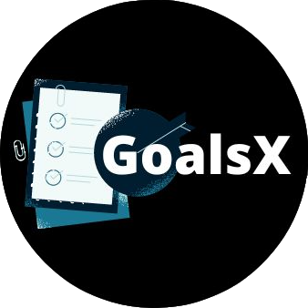
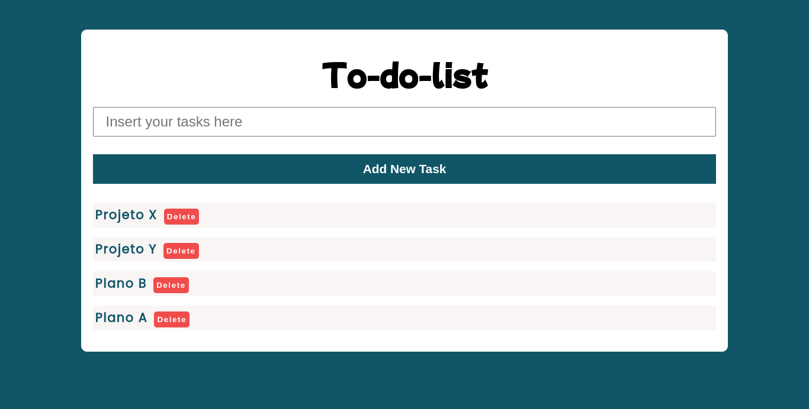

<p align="center">
       
<h1 align="center"> 
GoalsX Project <br>
</h1>
</p>

## 💻 Project

The **GoalsX** project is a website that lists goals to be achieved during the day, it is an extremely simple tool, but it can completely change the way you manage your time and make you a much more productive person.

<br>

<p align="center">
    
</p>

## 🚀 Technologies

- HTML
- CSS
- JAVASCRIPT

<br>

## ℹ️ How to Execute

1. Make a clone of the repository:

```sh
  $ git clone https://github.com/Djaysson/GoalsX.git
```

2. Application Execution:

```sh
 # Go to the project folder.
  $ cd GoalsX
  # To run the application click on the file below
  $ index.html
```

Made by Djayson Rodrigues 👋 [Linkedin](https://www.linkedin.com/in/djaysonrodrigues/)
